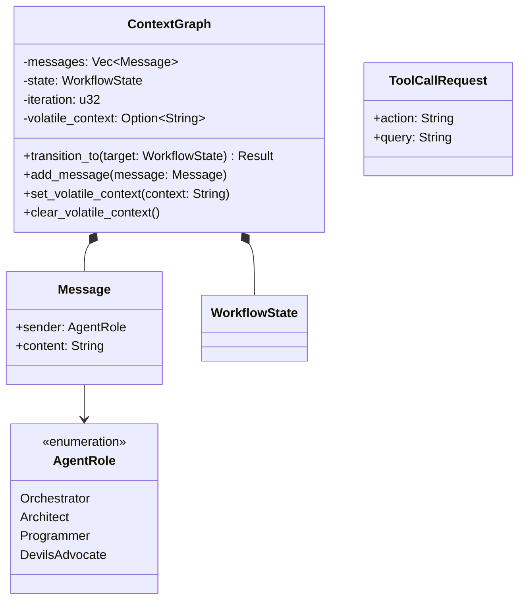
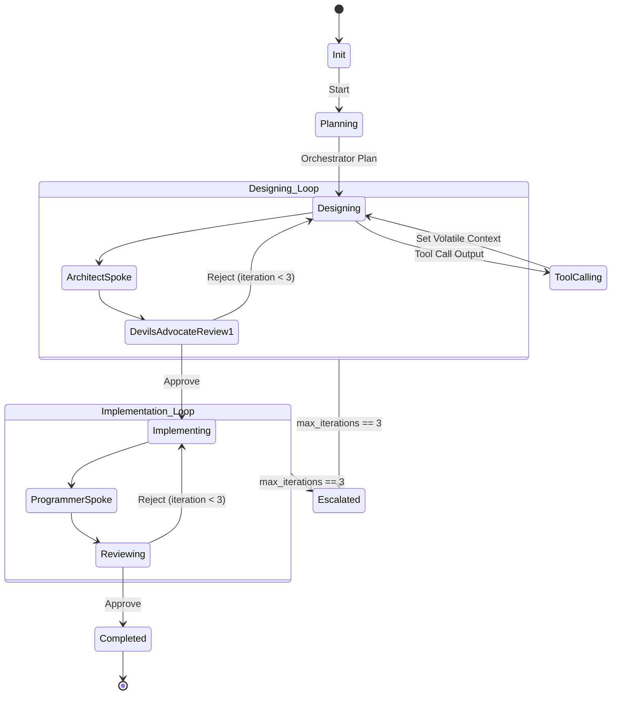

# lean-agents-rs
**ASUS GX10 (UMA) Optimized Qwen3.5-27B Multi-Agent System**

## 1. プロジェクト概要 (Project Overview)

本プロジェクトは、単一のハードウェア上で4つの役割を持つAIエージェント群が自律的に協調し、高品質なソフトウェアの設計・実装・レビューを行う**「非同期コンテキストグラフ・マルチエージェントシステム」**です。

LangChainやLangGraphといった既存の肥大化したフレームワークを一切排除し、Rustの型システムを活用した独自の状態遷移機械（State Machine）としてフルスクラッチで構築されています。これにより、極限までオーバーヘッドを削ぎ落とし、ハードウェアの限界性能を引き出します。

### 1.1 ターゲット環境と強烈なハードウェア制約

本システムは、以下の特殊なハードウェア環境で最高のTPS（Tokens Per Second）を叩き出すための**「専用・限界突破設計」**となっています。

* **ハードウェア:** ASUS Ascent GX10 (NVIDIA DGX Spark同等 / GB10)
* **アーキテクチャ:** ARM64 CPU + 単一Blackwell GPU
* **メモリ構造:** **128GB LPDDR5x UMA (Unified Memory Architecture)** / 帯域幅 273 GB/s
* **バックエンド推論エンジン:** SGLang (OpenAI互換ストリーミング API)
* **ターゲットLLM:** Qwen3.5-27B

**【UMA環境における最大の問題点】**
UMA環境では、CPU（Rustアプリケーション）とGPU（SGLang推論エンジン）が**物理メモリとその帯域幅を共有**します。もしRust側で無頓着に巨大な文字列を複製（`clone`）したり、LLMの応答を一度オンメモリにバッファリングしたり、不必要なコンテキストを履歴に溜め込むと、**SGLang側の推論に割り当てられるべきメモリ帯域をRust側が奪い取り、システム全体が致命的なパフォーマンス低下（TPS崩壊）を起こします。**

本プロジェクトのコードベースは、この物理制約を乗り越えるための「極限のメモリ節約機構」と「キャッシュヒット率の最大化機構」で構成されています。

---

## 2. コア・アーキテクチャの核心 (Core Architecture Deep Dive)

本システムが持つ、他フレームワークにはない4つの高度な設計思想を解説します。

### 2.1 揮発性コンテキスト (Volatile Context) によるGC（ガベージコレクション）機構

エージェントは未知の情報に遭遇した際、Tavily APIを用いてWeb検索（Tool Call）を行います。しかし、取得したHTMLスニペット等の検索結果を `Message` 履歴（永続コンテキスト）に保存することは**絶対に許されません**。ターン経過と共にLLMのKVキャッシュが爆発し、メモリ帯域を食いつぶすためです。

この問題に対処するため、`ContextGraph` には `volatile_context`（揮発性コンテキスト）が実装されています。
* 検索結果はこの領域に格納され、「直後の1ターンの推論でのみ参照」されます。
* 状態遷移（`transition_to`）が行われた瞬間、Rustのメモリ上から確実に破棄（`Option::take` によるDrop）されます。これにより履歴の肥大化を物理的に防ぎます。

### 2.2 RadixAttention (Prefix Caching) を極大化する厳格なプロンプト配列

SGLangのRadixAttention（Prefix Caching）を100%機能させるため、`Agent::build_messages` メソッドでは以下の**絶対に崩してはならない順序**でメッセージ配列が構築されます。

1. **System Prompt (不変のPrefix):** 常に配列の先頭。SGLangによって確実にキャッシュ・再利用されます。
2. **Message History (単調増加のPrefix):** 過去の会話履歴。過去のターンまでの履歴はすでにSGLang側にキャッシュされているため、差分（最新のメッセージ）のみが計算対象となります。
3. **Volatile Context (一時的・末尾のデータ):** 検索結果等は常に**配列の末尾**に追加されます。これを途中に挟むと前段のキャッシュがパージされますが、末尾に配置することでキャッシュを破壊せずに一時情報をLLMに与えることができます。

### 2.3 LLMレスポンス・ストリームの非バッファリング・チャンク解析

`SgLangClient::consume_stream` の実装において、LLMからの大容量レスポンスを一度にメモリに確保（バッファリング）することはしません。
* `reqwest` の `bytes_stream()` を使用し、ネットワークから到達した小さなバイトチャンクを順次処理。
* 改行コード (`\n`) で区切られたSSE (Server-Sent Events) フォーマットをその場でデシリアライズして差分文字列だけを結合していく設計により、UMA帯域の圧迫を最小限に抑えています。

### 2.4 RAIIとセマフォによる並行処理の絶対的制御（帯域保護）

Axum（API層）では、重い推論タスクが同時に実行され帯域が枯渇するのを防ぐため、`tokio::sync::Semaphore` を用いて同時実行数を `MAX_CONCURRENT_TASKS`（デフォルト: 4）に厳格に制限しています。

* **RAIIによる確実なロック解放:** リクエストごとに `acquire_owned()` で Permit (許可証) を取得し、それを `tokio::spawn` される非同期タスク内に**ムーブ（所有権の移動）**します。
* タスクが正常完了しようと、エラーになろうと、さらには `panic!` を起こそうと、タスク終了時にRustのメモリ管理機構によって自動的に Permit が Drop され、確実にロックが解放される安全な設計です。

---

## 3. エージェントの役割と相互作用 (Agent Roles & Interactions)

システムには4つの専門エージェントが存在し、それぞれ独立したシステムプロンプト（絶対制約）を持ちます。

| エージェント | 役割・制約 | Tool Callの利用方針 |
| :--- | :--- | :--- |
| **Orchestrator** | 計画立案、タスク分割、進捗管理、最終決定。自身ではコードを書かず、**Delegate Mode**に徹する。 | タスクの前提条件や最新の外部仕様の確認に使用。 |
| **Architect** | 技術選定、データ構造、インターフェース設計。具体的な機能実装には関与しない。 | 未知のライブラリ仕様やアーキテクチャの裏付け取得に必須。 |
| **Programmer** | Architectの設計書に忠実に従う実装担当。SDD/TDD（型・テスト先行）を厳守し、勝手な仕様変更は行わない。 | 実装中のAPI仕様、関数シグネチャの確認に使用。 |
| **DevilsAdvocate** | QA / 批評担当。破壊的な批判、セキュリティリスクの指摘を行うが、必ず建設的な代替案をセットで提示する。 | セキュリティクレームやエッジケースの事実確認等に使用。 |

### 3.1 思考プロセス (CoT) の保持と Tool Call パース

本システムのLLM出力パーサー (`parser::parse_agent_output`) は、一般的な「JSONのみを出力させる」方式とは異なります。
LLMの性能を引き出すため、**「自然言語での推論（Chain of Thought）とJSONの同時出力」**を許容しています。

* LLM出力内に存在する `{` と `}` をカウントし、有効なJSONブロック（`{"action": "search", "query": "..."}`）を抽出します。
* 同時に、JSONブロックの**「前」と「後」にある自然言語テキストを抽出し結合**します。
* ツール実行後も、この自然言語テキスト（推論過程）は永続コンテキストに保存されるため、エージェントは「なぜ検索を行ったのか」という自身の思考文脈を失うことなく次のターンの推論を行えます。

---

## 4. 状態遷移とフェールセーフ機構 (State Machine & Workflow)

本システムは、`WorkflowState` Enumによる厳密な状態遷移機械として実装されています。無無限ループやパースエラーによるデッドロックを防ぐ強力なフェールセーフ機構を備えています。

### 4.1 状態 (WorkflowState) 定義

1. `Init`: 初期状態。タスクを受信。
2. `Planning`: Orchestratorによる計画フェーズ。
3. `Designing`: ArchitectとDevilsAdvocateによる設計・レビューフェーズ。
4. `Implementing`: Programmerによる実装フェーズ。
5. `Reviewing`: DevilsAdvocateによる最終レビューフェーズ。リジェクト時は `Implementing` に戻り再実装。
6. `ToolCalling { return_to: Box<WorkflowState> }`: ツール実行用の一時ステート。実行後は元の状態（`return_to`）に自動復帰。
7. `Completed`: 正常完了。
8. `Escalated`: デッドロック・パースエラーによる強制終了ステート。

### 4.2 自己修正ループ (Self-Correction on Parse Error)

エージェントが不正なフォーマットを出力した場合、即座に終了するのではなく、以下の自己修正メカニズムが働きます。

1. パーサーがエラーを検知すると、一時的に `[System Error] Your previous output could not be parsed: <エラー詳細>. Please correct your response format.` というシステムからのフィードバックメッセージをコンテキストに挿入します。
2. 同一エージェントを再実行し、エラーを修正させます。
3. これを `MAX_PARSE_RETRIES`（最大3回）繰り返し、それでも失敗した場合は強制的に `Escalated` 状態に遷移して安全に停止します。

### 4.3 レビューイテレーション制限

設計（Designing）および実装（Implementing/Reviewing）フェーズにおいて、DevilsAdvocateからの「Approve（承認）」が得られずリジェクトが連続した場合、ループが `MAX_ITERATIONS`（最大3回）に達した時点で自動的に `Escalated` 状態に移行し、無限ループによるトークン消費を防ぎます。

---

## 5. ダイアグラム (Technical Diagrams)

### 5.1 コンテキスト・データ構造 (Domain Model)



### 5.2 メイン実行フローとエスカレーション機構 (Execution Flow)



### 5.3 SSE ストリーミング通信シーケンス (SSE Streaming Sequence)

```mermaid
sequenceDiagram
    participant Client
    participant API(Axum)
    participant Engine(Tokio)
    participant Agent
    participant LLM(SGLang)
    participant Web(Tavily)
    
    Client->>API: POST /v1/agent/stream {task}
    API->>API: Semaphore.acquire_owned() [Block if > MAX_CONCURRENT]
    API->>Engine: tokio::spawn(Engine::run)
    API-->>Client: 200 OK (text/event-stream)
    
    rect rgb(30, 30, 30)
        Engine->>Client: emit workflow_started
        
        loop Until Completed or Escalated
            Engine->>Client: emit state_changed
            Engine->>Client: emit agent_thinking
            Engine->>Agent: execute()
            Agent->>LLM: chat_completion (streaming)
            LLM-->>Agent: SSE Stream Chunks
            Agent-->>Engine: Parsed Output (Speech + Option<ToolCall>)
            
            alt Has ToolCall
                Engine->>Client: emit tool_call_executed
                Engine->>Web: search(query)
                Web-->>Engine: Results
                Engine->>Engine: set volatile_context
            else Speech Only
                Engine->>Client: emit agent_spoke
                Engine->>Engine: clear volatile_context
            end
        end
        
        Engine->>Client: emit workflow_completed (or escalated)
    end
    Note over API, Engine: Task Finish: Permit automatically dropped (RAII)
```



---

## 6. API リファレンス (API Reference)

APIは、長時間の非同期処理をリアルタイムでクライアントにフィードバックするため、**Server-Sent Events (SSE)** を使用しています。

### `POST /v1/agent/stream`

エージェント・ワークフローを起動し、進行状況をストリーミングします。

**Request:**
* Headers: `Content-Type: application/json`
* Body:
```json
{
  "task": "RustとAxumを使用して、セキュアなJWT認証付きREST APIの設計と実装を行って。"
}
```

**Response:**
* Status: `200 OK` (タスクキュー待ちが発生しても即座に200が返ります)
* Headers: `Content-Type: text/event-stream`, `Transfer-Encoding: chunked`

イベントは `data: <JSON>` 形式でストリーミングされ、全てのJSONは `type` フィールドを持つタグ付きユニオン (`EngineEvent`) としてシリアライズされます。

#### イベント種別 (EngineEvent Payloads)

**1. `workflow_started`** (処理開始)
```json
{"type": "workflow_started", "task": "RustとAxumを使用して..."}
```

**2. `state_changed`** (状態遷移)
```json
{"type": "state_changed", "from": "Init", "to": "Planning"}
```

**3. `agent_thinking`** (LLMへ推論リクエスト中)
```json
{"type": "agent_thinking", "role": "Architect"}
```

**4. `agent_spoke`** (エージェントの思考や発言結果)
```json
{"type": "agent_spoke", "role": "Architect", "content": "設計方針についてですが..."}
```

**5. `tool_call_executed`** (外部ツールの実行インターセプト)
```json
{"type": "tool_call_executed", "role": "Programmer", "action": "search", "query": "axum jwt auth example"}
```

**6. `workflow_completed`** (正常完了・タスク終了)
```json
{"type": "workflow_completed"}
```

**7. `workflow_escalated`** (エラーまたは上限到達による強制停止)
```json
{"type": "workflow_escalated", "reason": "Review phase exceeded max iterations"}
```

#### クライアント実装例 (JavaScript / Webブラウザ)

```javascript
const response = await fetch('http://localhost:8080/v1/agent/stream', {
    method: 'POST',
    headers: { 'Content-Type': 'application/json' },
    body: JSON.stringify({ task: "Tavily APIのドキュメントを検索して使い方をまとめて" })
});

const reader = response.body.getReader();
const decoder = new TextDecoder();

while (true) {
    const { value, done } = await reader.read();
    if (done) break;
    
    const chunk = decoder.decode(value);
    const lines = chunk.split('\n');
    
    for (const line of lines) {
        if (line.startsWith('data: ')) {
            const data = JSON.parse(line.substring(6));
            console.log(`[${data.type}]`, data);
            
            if (data.type === 'agent_spoke') {
                console.log(`${data.role}: ${data.content}`);
            }
        }
    }
}
```

---

## 7. リポジトリのディレクトリ構成とモジュール設計

```text
.
├── Cargo.toml               # 依存関係定義 (tokio, axum, reqwest, serde等)
├── docker-compose.yml       # SGLangとAPIサーバーの起動構成
├── Dockerfile               # APIサーバーのマルチステージビルド
└── src/
    ├── main.rs              # エントリポイント、環境変数読み込み、サーバー起動
    ├── lib.rs               # モジュール宣言、共通エラー型定義(AppError)
    ├── error.rs             # (lib.rs内に統合)
    │
    ├── agents/              # エージェント定義層
    │   ├── mod.rs           # Agentトレイト、RadixAttention保護プロンプト構築ロジック
    │   ├── orchestrator.rs  # 計画担当プロンプト
    │   ├── architect.rs     # 設計担当プロンプト
    │   ├── programmer.rs    # 実装担当プロンプト
    │   └── devils_advocate.rs # 批評担当プロンプト
    │
    ├── client/              # 外部API通信層
    │   ├── mod.rs
    │   ├── llm.rs           # SGLangクライアント (自前ストリーミング・パース実装)
    │   └── search.rs        # Tavily検索APIクライアント
    │
    ├── domain/              # ドメインモデル層 (副作用を持たない純粋なデータ構造)
    │   ├── mod.rs
    │   ├── agent.rs         # AgentRole Enum (エージェント種別)
    │   ├── context.rs       # ContextGraph (永続履歴、揮発性コンテキスト、イテレーション管理)
    │   ├── event.rs         # EngineEvent Enum (SSEで流すイベント定義)
    │   ├── message.rs       # 履歴用メッセージ構造体
    │   ├── state.rs         # WorkflowState Enum と状態遷移判定ロジック
    │   └── tool_call.rs     # パースされたToolCallRequestの構造体
    │
    ├── engine/              # コア実行エンジン
    │   └── mod.rs           # 状態遷移ループ、自己修正リトライ、Escalation判定、イベント発火
    │
    ├── parser/              # 文字列解析モジュール
    │   └── mod.rs           # JSON抽出、CoT分離、Approve/Reject判定アルゴリズム
    │
    └── server/              # HTTP API層
        ├── mod.rs
        ├── router.rs        # Axumルーター、エンドポイント定義、SSEストリーム変換
        └── state.rs         # AppState定義、セマフォ(Semaphore)による同時実行制御
```

---

## 8. 環境構築とデプロイメント (Setup & Deployment)

### 8.1 必須環境変数 (Environment Variables)

| 変数名 | デフォルト値 | 説明 |
| :--- | :--- | :--- |
| `SGLANG_URL` | `http://localhost:30000` | SGLang 推論サーバーのエンドポイントURL |
| `SGLANG_MODEL` | `Qwen/Qwen3.5-27B` | SGLangにロードされているモデルのID |
| `TAVILY_API_KEY` | **(必須)** | Tavily Search APIのキー。未設定の場合検索機能がエラーになります |
| `MAX_CONCURRENT_TASKS` | `4` | 物理メモリ帯域を保護するための最大同時推論タスク数 |
| `PORT` | `8080` | APIサーバーの待受ポート |
| `RUST_LOG` | `info` | ログ出力レベル (`debug`, `info`, `warn`, `error`) |

### 8.2 Docker Compose を用いたデプロイ (推奨)

NVIDIA GPUドライバとNVIDIA Container Toolkitがセットアップされた環境で、以下のコマンドを実行します。SGLangとAPIサーバーが同時に立ち上がります。

```bash
# APIキーを環境変数にセット
export TAVILY_API_KEY="tvly-your-api-key"

# ビルドしてバックグラウンドで起動
docker-compose up --build -d

# ログの確認
docker-compose logs -f
```

※ SGLang (GPU推論環境) で巨大なモデル（27B）のロードが完了し、`http://localhost:30000/health` のヘルスチェックが通るまでAPIコンテナは待機状態になります。

### 8.3 ローカル開発・テスト (Local Development)

Rustツールチェーンがインストールされている環境で、各種テストを実行できます。本プロジェクトはTDDの原則に従い、ドメインロジックからパーサー、通信クライアントのモックテストまで網羅的にテストが記述されています。

```bash
# 全テストの実行
cargo test

# 特定のモジュール（パーサー）のテスト実行
cargo test parser::tests -- --nocapture

# リリースビルド
cargo build --release
```

サーバーを単体でローカル起動する場合：
```bash
TAVILY_API_KEY="tvly-xxx" cargo run
```

---

## 9. 開発・拡張ガイド (Developer Guide)

### 9.1 新しいツールの追加方法

現在サポートされている Tool Call は `{"action": "search", "query": "..."}` のみですが、新しい機能（例: ファイル書き込み、コマンド実行）を追加する場合は以下の手順を踏みます。

1. **ドメイン拡張:** `src/domain/tool_call.rs` の `ToolCallRequest` を拡張し、新しいパラメータを受け取れるようにします。
2. **パーサー拡張:** `src/parser/mod.rs` 内の `parse_agent_output` にて、新しいアクション名（例: `write_file`）の解析処理を追加します。
3. **クライアント実装:** `src/client/` に新しい非同期クライアントトレイトを実装します。
4. **エンジン組み込み:** `src/engine/mod.rs` の `execute_with_tool_support` メソッド内で、マッチした新しいアクションごとの副作用処理を実装し、結果を `volatile_context` または `Message` 履歴にフィードバックします。
5. **プロンプト修正:** `src/agents/*.rs` のシステムプロンプトに、新しいツールのJSONフォーマット仕様と利用条件を追記します。

### 9.2 今後のロードマップ (Future Roadmap)

1. **キャンセレーショントークンの導入 (Graceful Shutdown)**
   現状、SSEクライアントがネットワーク切断等で離脱しても、エンジンループ（バックグラウンドのTokioタスク）は最後まで完遂してしまいます。`tokio::select!` を用いてクライアントのストリーム切断（チャネルクローズ）を検知し、即座にGPUリソースへのリクエストを中止しセマフォを解放する機能の追加。
2. **Human-in-the-Loop (HITL) エスカレーション・リカバリ**
   `Escalated` 状態に陥った際、タスクを破棄するのではなく、API経由で人間（ユーザー）が直接指示やアドバイスを与え、任意の状態（例えば `Reviewing`）から推論を再開させる対話的フェーズの構築。
3. **実機パフォーマンステスト・セマフォチューニング**
   ASUS GX10 (UMA) において、モデルのクオンタイズ（量子化）レベルや推論コンテキスト長に応じた UMA帯域飽和点を `nvidia-smi` および `perf` で精密に計測し、`MAX_CONCURRENT_TASKS` の最適値を動的に算出する仕組みの導入。