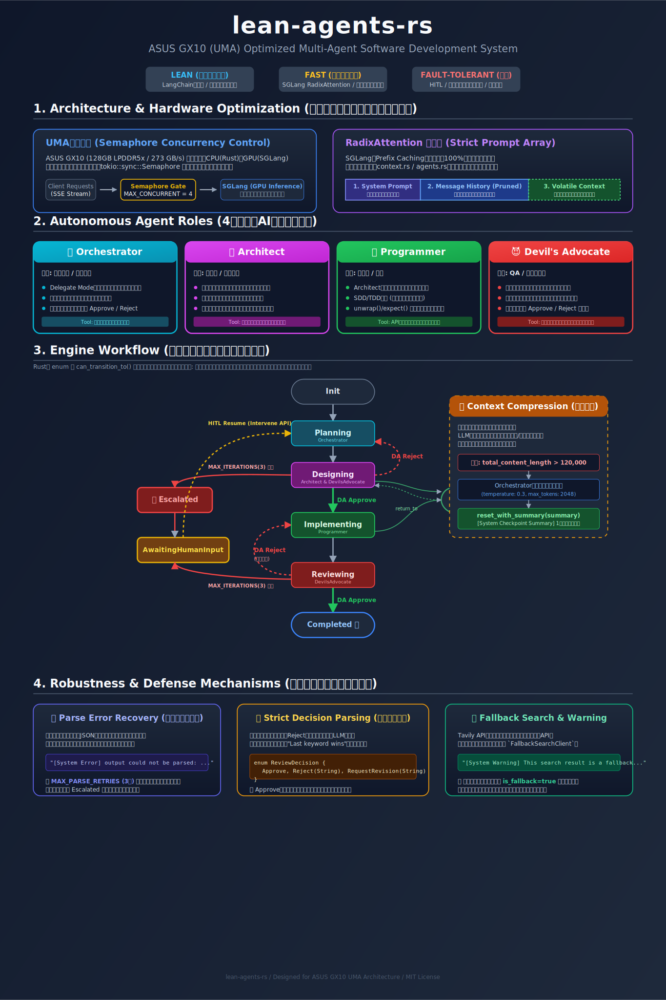
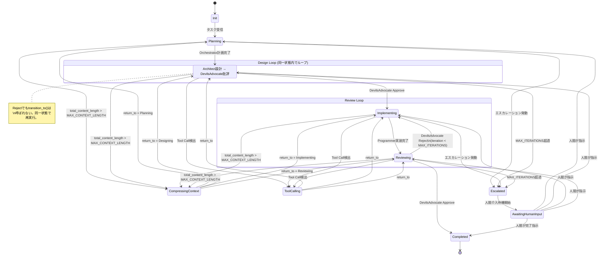

# lean-agents-rs

**ASUS GX10 (UMA) Optimized Multi-Agent Software Development System in Rust**


<p align="center">
  
</p>


---

## 1. Project Overview (プロジェクト概要)

`lean-agents-rs` は、単一のハードウェア上で4つの専門AIエージェント（Orchestrator, Architect, Programmer, DevilsAdvocate）が自律的に協調し、ソフトウェアの設計・実装・レビューを行う **非同期マルチエージェントシステム** です。

### 設計思想: Lean, Fast, Fault-tolerant

| 原則 | 詳細 |
| :--- | :--- |
| **Lean** | LangChain / LangGraph 等の肥大化フレームワークを一切排除。Rustの型システムで状態遷移を静的に保証するフルスクラッチ設計。 |
| **Fast** | SGLang の RadixAttention（Prefix Caching）を最大化する厳格なプロンプト配列。UMA帯域を守る揮発性コンテキスト機構。LLMレスポンスの非バッファリング・ストリーム処理。 |
| **Fault-tolerant** | 決してクラッシュしないステートマシン。パースエラー自己修正、イテレーション上限によるデッドロック防止、コンテキスト圧縮による自己修復、Human-in-the-Loop (HITL) によるエスカレーション・復帰機構。 |

### 本システムが解決する課題

1. **UMA帯域の競合問題:** CPU（Rustアプリ）とGPU（SGLang推論）が物理メモリ帯域を共有する環境で、Rust側がメモリ帯域を浪費するとGPU推論のTPS（Tokens Per Second）が崩壊する。本システムはこの物理制約を、揮発性コンテキスト・非バッファリングストリーム・セマフォ制御で克服する。
2. **LLMエージェントの暴走:** 無限ループ、パースエラー、コンテキスト肥大化によるハルシネーション。本システムはステートマシンと複数のフェールセーフ機構でこれを根絶する。
3. **フレームワーク依存の排除:** Python系フレームワークのオーバーヘッド（GIL、GC、動的型付け）を完全に排除し、Rustのゼロコスト抽象化で極限のパフォーマンスを実現する。

### ターゲット環境

| 項目 | 仕様 |
| :--- | :--- |
| **ハードウェア** | ASUS Ascent GX10 (NVIDIA DGX Spark 同等 / GB10) |
| **アーキテクチャ** | ARM64 CPU + 単一 Blackwell GPU |
| **メモリ** | 128GB LPDDR5x UMA (Unified Memory Architecture) / 帯域幅 273 GB/s |
| **推論エンジン** | SGLang (OpenAI 互換ストリーミング API) |
| **ターゲットLLM** | Qwen3.5-27B |

---

## 2. Architecture & Design Philosophy (アーキテクチャと設計思想)

### 2.1 UMA帯域保護: セマフォによる並行制御

ASUS GX10 の 128GB LPDDR5x UMA 環境では、CPU と GPU が物理メモリ帯域（273 GB/s）を共有します。複数の重い推論タスクが同時実行されると帯域が飽和し、システム全体が致命的な性能劣化を起こします。

本システムでは `tokio::sync::Semaphore` を用いて同時実行タスク数を `MAX_CONCURRENT_TASKS`（デフォルト: 4）に厳格に制限しています。

```rust
// server/state.rs
pub struct AppState {
    semaphore: Arc<Semaphore>,           // 並行数の制御弁
    active_interventions: Arc<DashMap<String, mpsc::Sender<(String, WorkflowState)>>>,
    // ...
}
```

リクエストごとに `acquire_owned()` で Permit を取得し、`tokio::spawn` される非同期タスク内にムーブします。タスクが正常完了・エラー・`panic!` のいずれで終了しても、RustのRAII機構により Permit は確実に Drop され、ロックが解放されます。

### 2.2 RadixAttention (Prefix Caching) の極大化

SGLang の RadixAttention を100%機能させるため、`Agent::build_messages` メソッドでは以下の **絶対に崩してはならない順序** でメッセージ配列を構築します。

```
┌──────────────────────────────────┐
│ 1. System Prompt (不変 Prefix)    │  ← SGLangが確実にキャッシュ・再利用
├──────────────────────────────────┤
│ 2. Message History (単調増加)     │  ← 差分のみが計算対象
├──────────────────────────────────┤
│ 3. Volatile Context (一時的・末尾) │  ← キャッシュを破壊せず一時情報を注入
└──────────────────────────────────┘
```

- **System Prompt**: 各エージェント固有の不変プロンプト。常に配列の先頭に配置され、SGLangによってキャッシュされます。
- **Message History**: 過去の会話履歴。自分のメッセージは `assistant` ロール、他エージェントのメッセージは `user` ロールとして `[AgentRole] content` のフォーマットで追加されます。
- **Volatile Context**: 検索結果等の一時データ。`[Temporary Reference — do not store]` ヘッダーを付与し、末尾に `user` ロールとして配置することで、System Promptのキャッシュを破壊しません。

### 2.3 RAII と CancellationToken によるGPUリソース解放

`tokio_util::sync::CancellationToken` を用いて、SSEクライアントの切断を検知し、即座にGPUリソースへのリクエストを中止します。

```rust
// engine/mod.rs — Engine::run のメインループ
tokio::select! {
    _ = cancel_token.cancelled() => {
        warn!("Workflow cancelled by cancellation token");
        return Err(AppError::Cancelled);
    }
    result = async { /* メインステートマシンループ */ } => result,
}
```

ツール実行（Web検索）中にもキャンセレーションが監視されており、クライアント離脱時にバックグラウンドで無駄なリソース消費が継続することを防ぎます。

### 2.4 LLMレスポンスの非バッファリング・チャンク解析

`SgLangClient::consume_stream` は、LLMからの大容量レスポンスを一度にメモリに確保しません。

- `reqwest` の `bytes_stream()` でネットワークから到達した小さなバイトチャンクを順次処理。
- 改行コード (`\n`) で区切られたSSEフォーマットをその場でデシリアライズし、差分文字列だけを結合。
- UMA帯域の圧迫を最小限に抑えます。

---

## 3. Key Features (主要機能)

### 3.1 State Machine Engine — 状態遷移ベースの推論ループ

本システムの中核は `Engine::run` による無限ループのステートマシンです。`WorkflowState` Enum（10状態）による厳密な状態遷移を行い、不正な遷移はコンパイル時の型チェックとランタイムの `can_transition_to()` で二重に防止されます。

**主要な定数:**

| 定数 | 値 | 用途 |
| :--- | :--- | :--- |
| `MAX_ITERATIONS` | 3 | 設計/レビューフェーズの最大イテレーション回数。超過でエスカレーション。 |
| `MAX_TOOL_CALLS_PER_TURN` | 3 | 1エージェントターンあたりの最大ツール呼び出し回数。 |
| `MAX_PARSE_RETRIES` | 3 | 出力パースエラーの最大リトライ回数。超過でエスカレーション。 |

**パースエラー自己修正メカニズム:**

エージェントが不正なフォーマットを出力した場合、即座に終了せず自己修正を試みます。

1. パーサーがエラーを検知 → `[System Error] Your previous output could not be parsed: <詳細>` をOrchestratorロールのメッセージとしてコンテキストに挿入。
2. 同一エージェントを再実行し、エラーを修正させる。
3. リトライ回数が `MAX_PARSE_RETRIES`（3）を超過した場合（4回目の失敗時）、`Escalated` 状態に遷移して安全に停止。

### 3.2 Human-in-the-Loop (HITL) — エスカレーションと人間介入・復帰機構

エンジンが自力で解決できない問題（設計のデッドロック、パースエラーの連続、レビュー上限超過）に遭遇した場合、ワークフローを安全に停止し、人間の介入を待つ機構です。

**エスカレーションの発動条件:**

1. **設計フェーズのデッドロック:** `Designing` でDevilsAdvocateが `MAX_ITERATIONS`（3回）連続リジェクト。
2. **レビューフェーズのデッドロック:** `Reviewing` でDevilsAdvocateが `MAX_ITERATIONS`（3回）連続リジェクト。
3. **パースエラーの連続失敗:** エージェントが `MAX_PARSE_RETRIES`（3回）連続で有効な出力を生成できない。

**エスカレーションフロー:**

```
1. UUID (task_id) を生成
2. mpsc チャネル (容量1) を作成し、DashMap に task_id → Sender を登録
3. 状態を Escalated に遷移 → workflow_escalated イベントを発火
4. 状態を AwaitingHumanInput に遷移 → state_changed イベントを発火
5. チャネルの Receiver で人間の介入をブロッキング待機
```

**復帰フロー（`POST /v1/agent/intervene` 経由）:**

```
1. 外部APIが task_id で DashMap からチャネルの Sender を取得
2. (human_message, resume_state) タプルを送信
3. エンジンが受信: Human メッセージをコンテキストに追加
4. 指定された resume_state に遷移（Planning, Designing, Implementing, Reviewing, Completed）
5. ワークフローを再開
```

### 3.3 Context Compression — 動的コンテキスト圧縮と自己修復

長時間のワークフローではメッセージ履歴が肥大化し、LLMのKVキャッシュを圧迫するとともにハルシネーションの原因となります。本システムは `MAX_CONTEXT_LENGTH`（デフォルト: 120,000文字）を超過した時点で、自動的にコンテキストを圧縮します。

**圧縮トリガー条件:**

```rust
if !just_compressed
    && matches!(current, Planning | Designing | Implementing | Reviewing)
    && context.total_content_length() > max_context_length
```

**圧縮フロー:**

1. 現在の状態を `CompressingContext { return_to: Box<現在の状態> }` に遷移。
2. 全メッセージ履歴を `[Sender] content` 形式で連結し、Orchestratorに要約を依頼。
   - `temperature: 0.3`（確定的な要約のため低ランダム性）
   - `max_tokens: 2048`（暴走防止）
3. `context.reset_with_summary(summary)` で全メッセージを消去し、`[System Checkpoint Summary]\n{要約}` の単一メッセージに置換。
4. 元の状態（`return_to`）に復帰。

**`just_compressed` ガード — 無限ループ防止:**

LLM生成の要約自体が `MAX_CONTEXT_LENGTH` を超過するケースに対処するため、圧縮直後は `just_compressed = true` フラグがセットされ、次のメインループ反復まで再圧縮がスキップされます。これにより「圧縮→超過→再圧縮→超過…」の無限ループを物理的に防止します。

### 3.4 Fallback Search Mechanism — 代替検索と品質劣化警告

`FallbackSearchClient` は複数の `SearchClient` 実装をチェーン接続し、プライマリ（Tavily API）が枯渇・障害を起こした場合に自動的にフォールバック検索を実行します。

```rust
// client/search.rs
pub struct FallbackSearchClient {
    clients: Vec<Box<dyn SearchClient>>,
}
```

- クライアントリストを先頭から順に試行し、最初に成功したクライアントの結果を返却。
- **品質劣化の自動通知:** フォールバッククライアント（2番目以降）から取得した結果には `is_fallback = true` フラグが付与されます。エンジンはこのフラグを検知し、System Warning をコンテキストに動的注入することで、エージェントに「情報の信頼性が通常より低い可能性がある」ことを認識させます。
- 全クライアントが失敗した場合のみエラーを返却。

---

## 4. Agents & Roles (エージェントと役割)

システムには6つの役割（`AgentRole` Enum）が定義されており、うち4つがLLMエージェント、2つがシステム予約です。

### 4.1 LLMエージェント（4種）

| エージェント | 役割 | 制約 | Tool Call方針 |
| :--- | :--- | :--- | :--- |
| **Orchestrator** | 計画立案、タスク分割、進捗管理、最終決定 | 自身ではコードを書かず **Delegate Mode** に徹する。`Approve` / `Reject` で他エージェントの出力を制御。 | タスクの前提条件・外部仕様の確認 |
| **Architect** | 技術選定、データ構造設計、インターフェース設計 | 具体的な機能実装には関与しない。不確実な外部仕様は必ず検索で裏付けを取る。 | ライブラリ仕様・アーキテクチャの裏付け取得 |
| **Programmer** | Architectの設計書に忠実な実装 | 設計意図を勝手に変更しない。SDD/TDD（型・テスト先行）厳守。`unwrap()` / `expect()` はテストコード以外で使用禁止。 | API仕様・関数シグネチャの確認 |
| **DevilsAdvocate** | 破壊的批判、セキュリティリスク指摘、エッジケース発見 | 必ず建設的な代替案をセットで提示。`Approve` / `Reject` で設計・実装を判定。 | セキュリティクレーム・エッジケースの事実確認 |

### 4.2 システム予約ロール（2種）

| ロール | 用途 |
| :--- | :--- |
| **System** | コンテキスト圧縮サマリ `[System Checkpoint Summary]` の送信者。なお、パースエラーのフィードバックメッセージ（`[System Error] ...`）は内容的にはシステムメッセージだが、実装上は `Orchestrator` ロールとして注入される。 |
| **Human** | HITL介入時に人間が送信したメッセージの送信者。`POST /v1/agent/intervene` 経由で注入される。 |

### 4.3 思考プロセス (CoT) の保持と Tool Call パース

`parser::parse_agent_output` は「JSONのみを出力させる」方式ではなく、**自然言語での推論（Chain of Thought）とJSONの同時出力** を許容します。

- LLM出力内の `{` と `}` をカウントし、有効なJSONブロック（`{"action": "search", "query": "..."}`）を抽出。
- JSONブロックの前後にある自然言語テキストを結合し、推論過程（CoT）として永続コンテキストに保存。
- ツール実行後もエージェントは「なぜ検索を行ったのか」という思考文脈を失わずに次のターンの推論を行えます。

**パーサーの検証ルール:**
- `action` は `"search"` のみ許可
- `query` は空文字列不可、10,000文字以下
- 不正なJSONは純粋な speech（自然言語出力）として扱われる

---

## 5. State Transition Flow (状態遷移フロー)

### 5.1 WorkflowState 定義（10状態）

| 状態 | 種別 | 説明 |
| :--- | :--- | :--- |
| `Init` | 開始 | 初期状態。タスクを受信しコンテキストに追加。 |
| `Planning` | メイン | Orchestratorによる計画立案。 |
| `Designing` | メイン | ArchitectとDevilsAdvocateによる設計・レビュー。 |
| `Implementing` | メイン | Programmerによる実装。 |
| `Reviewing` | メイン | DevilsAdvocateによる最終レビュー。リジェクト時は `Implementing` に差し戻し。 |
| `ToolCalling { return_to }` | 一時 | ツール実行用。完了後は `return_to` に自動復帰。イテレーションをインクリメントしない。 |
| `CompressingContext { return_to }` | 一時 | コンテキスト圧縮中。完了後は `return_to` に自動復帰。イテレーションをインクリメントしない。 |
| `Completed` | 終了 | 正常完了。 |
| `Escalated` | 緊急 | エスカレーション発動。即座に `AwaitingHumanInput` に遷移。 |
| `AwaitingHumanInput` | 待機 | 人間の介入をブロッキング待機。介入後は任意のメイン状態に復帰可能。 |

### 5.2 状態遷移図 (Mermaid)



---

## 6. API Reference (APIリファレンス)

本システムは Server-Sent Events (SSE) を用いたストリーミングAPIを提供します。

### 6.1 `POST /v1/agent/stream`

エージェント・ワークフローを起動し、進行状況をリアルタイムでストリーミングします。

**Request:**

```http
POST /v1/agent/stream HTTP/1.1
Content-Type: application/json

{
  "task": "RustとAxumを使用して、セキュアなJWT認証付きREST APIの設計と実装を行って。"
}
```

**Response:**

- Status: `200 OK`（セマフォ取得待ちが発生しても即座に200が返る）
- Status: `400 Bad Request`（task が空文字列の場合）
- Status: `503 Service Unavailable`（セマフォがクローズされている場合）
- Headers: `Content-Type: text/event-stream`, `Transfer-Encoding: chunked`

**SSEイベントフォーマット:**

全イベントは `data: <JSON>\n\n` 形式でストリーミングされ、JSON は `type` フィールドを持つタグ付きユニオン（`EngineEvent`）です。

#### イベント種別

**1. `workflow_started`** — ワークフロー開始

```json
{"type": "workflow_started", "task": "RustとAxumを使用して..."}
```

**2. `ping`** — ハートビート（Keep-Alive）

```json
{"type": "ping"}
```

**3. `state_changed`** — 状態遷移

```json
{"type": "state_changed", "from": "Init", "to": "Planning"}
```

**4. `agent_thinking`** — エージェントがLLM推論中

```json
{"type": "agent_thinking", "role": "Architect"}
```

**5. `agent_spoke`** — エージェントの発言

```json
{"type": "agent_spoke", "role": "Architect", "content": "設計方針についてですが..."}
```

**6. `tool_call_executed`** — ツール実行

```json
{"type": "tool_call_executed", "role": "Programmer", "action": "search", "query": "axum jwt auth example"}
```

**7. `workflow_completed`** — 正常完了

```json
{"type": "workflow_completed"}
```

**8. `workflow_escalated`** — エスカレーション（停止）

```json
{"type": "workflow_escalated", "reason": "Review phase exceeded max iterations", "task_id": "a1b2c3d4-e5f6-..."}
```

`task_id` はHITL介入に使用するUUID。`POST /v1/agent/intervene` に渡すことで復帰可能。

#### SSE通信シーケンス

```mermaid
sequenceDiagram
    participant Client
    participant API as API (Axum)
    participant Engine as Engine (Tokio)
    participant Agent
    participant LLM as LLM (SGLang)
    participant Web as Web (Tavily)

    Client->>API: POST /v1/agent/stream {task}
    API->>API: Semaphore.acquire_owned()
    API->>Engine: tokio::spawn(Engine::run)
    API-->>Client: 200 OK (text/event-stream)

    rect rgb(30, 30, 30)
        Engine->>Client: workflow_started
        loop Until Completed or Escalated
            Engine->>Client: state_changed
            Engine->>Client: agent_thinking
            Engine->>Agent: execute()
            Agent->>LLM: chat_completion (streaming)
            LLM-->>Agent: SSE Stream Chunks
            Agent-->>Engine: ParsedOutput (Speech + Option ToolCall)

            alt Has ToolCall
                Engine->>Client: tool_call_executed
                Engine->>Web: search(query)
                Web-->>Engine: Results
                Engine->>Engine: set volatile_context
            else Speech Only
                Engine->>Client: agent_spoke
                Engine->>Engine: clear volatile_context
            end
        end
        Engine->>Client: workflow_completed / workflow_escalated
    end
    Note over API, Engine: Permit automatically dropped (RAII)
```



### 6.2 `POST /v1/agent/intervene`

エスカレーションされたワークフローに人間が介入し、任意の状態から再開させます。

**Request:**

```http
POST /v1/agent/intervene HTTP/1.1
Content-Type: application/json

{
  "task_id": "a1b2c3d4-e5f6-7890-abcd-ef1234567890",
  "message": "設計方針を変更します。REST APIではなくgRPCを採用してください。",
  "resume_state": "Designing"
}
```

| フィールド | 型 | 説明 |
| :--- | :--- | :--- |
| `task_id` | String | `workflow_escalated` イベントで返却されたUUID |
| `message` | String | 人間からエージェントへの指示メッセージ。コンテキストに `Human` ロールとして追加される。 |
| `resume_state` | WorkflowState | 復帰先の状態（`"Planning"`, `"Designing"`, `"Implementing"`, `"Reviewing"`, `"Completed"`） |

**Response:**

- `200 OK` — 介入成功。エンジンがブロッキング解除され、指定状態から再開。
- `404 Not Found` — `task_id` が存在しない（既に完了・タイムアウト）。
- `500 Internal Server Error` — エンジン側のチャネルが既にクローズされている。

---

## 7. Setup & Deployment (環境構築と起動)

### 7.1 環境変数

| 変数名 | デフォルト値 | 説明 |
| :--- | :--- | :--- |
| `SGLANG_URL` | `http://localhost:30000` | SGLang推論サーバーのエンドポイントURL |
| `SGLANG_MODEL` | `Qwen3.5-27B` | SGLangにロードされているモデルのID |
| `TAVILY_API_KEY` | **(必須)** | Tavily Search APIのキー。未設定の場合、検索機能がエラーになります |
| `MAX_CONCURRENT_TASKS` | `4` | 物理メモリ帯域を保護するための最大同時推論タスク数 |
| `MAX_CONTEXT_LENGTH` | `120000` | コンテキスト圧縮が発動するメッセージ合計文字数の閾値 |
| `PORT` | `8080` | APIサーバーの待受ポート |
| `RUST_LOG` | `info` | ログ出力レベル（`debug`, `info`, `warn`, `error`） |

### 7.2 Docker Compose を用いたデプロイ（推奨）

NVIDIA GPUドライバと NVIDIA Container Toolkit がセットアップされた環境で実行します。

```bash
# APIキーを環境変数にセット
export TAVILY_API_KEY="tvly-your-api-key"

# ビルドしてバックグラウンドで起動
docker-compose up --build -d

# ログの確認
docker-compose logs -f
```

**Docker Compose 構成:**

| サービス | イメージ | ポート | 説明 |
| :--- | :--- | :--- | :--- |
| `sglang` | `lmsysorg/sglang:latest` | `30000` | GPU推論サーバー。GPU メモリの 85% を静的確保。ヘルスチェック（`/health`）通過まで lean-agents は待機。 |
| `lean-agents` | ローカルビルド | `8080` | Rust APIサーバー。SGLangのヘルスチェック通過後に起動。 |

### 7.3 ローカル開発・テスト

```bash
# 全テストの実行
cargo test

# 特定モジュールのテスト（例: パーサー）
cargo test parser::tests -- --nocapture

# リリースビルド
cargo build --release

# サーバーのローカル起動
TAVILY_API_KEY="tvly-xxx" cargo run
```

---

## 8. Included Tools (付属ツール)

### 8.1 CLI Client (`tools/cli_client/client.py`)

Python製のインタラクティブCLIクライアント。SSEストリームをリアルタイムで表示し、HITL介入をサポートします。

**依存ライブラリ:** `httpx`, `httpx_sse`, `rich` (Python 3.10+)

**起動方法:**

```bash
cd tools/cli_client
uv run client.py
# または
uv run client.py --host localhost --port 8080
```

**機能:**

- **ロール別カラー表示:** Orchestrator（cyan）、Architect（magenta）、Programmer（green）、DevilsAdvocate（red）、System（yellow）
- **リアルタイムSSEストリーミング:** 全イベント種別（`workflow_started`, `state_changed`, `agent_thinking`, `agent_spoke`, `tool_call_executed`, `workflow_completed`, `workflow_escalated`, `ping`）を表示
- **HITL介入モード:** `workflow_escalated` イベント受信時、自動的に介入プロンプトを表示:
  1. 人間がメッセージを入力
  2. 復帰先フェーズを選択（Planning / Designing / Implementing / Reviewing）
  3. `POST /v1/agent/intervene` に送信してワークフローを再開

**使用例:**

```
🚀 lean-agents-rs CLI Client
Server: http://localhost:8080
Enter task (or 'quit'): RustでJWT認証のREST APIを設計・実装して

[workflow_started] Task: RustでJWT認証のREST APIを設計・実装して
[state_changed] Init → Planning
[agent_thinking] Orchestrator
[agent_spoke] Orchestrator: まず、以下の3点を計画します...
[state_changed] Planning → Designing
...
[workflow_escalated] Reason: Design phase exceeded max iterations
  task_id: a1b2c3d4-...

⚠️  Workflow escalated! Enter intervention message:
> REST APIの認証にはJWTではなくOAuth2を使ってください
Select resume phase (1=Planning, 2=Designing, 3=Implementing, 4=Reviewing): 2
✅ Intervention sent successfully
[state_changed] AwaitingHumanInput → Designing
...
```

### 8.2 UMA Profiler (`scripts/profile_uma.sh`)

ASUS GX10 の UMA 帯域使用量を `nvidia-smi dmon` で計測し、`MAX_CONCURRENT_TASKS` の最適値を決定するためのプロファイリングスクリプトです。

**前提条件:** `nvidia-smi`, `uv`, `awk`

**使用方法:**

```bash
# デフォルト設定で実行
./scripts/profile_uma.sh

# ログ出力先を指定
./scripts/profile_uma.sh --log-dir /tmp/profiling
```

**実行内容:**

1. `nvidia-smi dmon` をメモリモードで起動（1秒間隔のサンプリング）
2. `tests/test_runner.py --run-concurrent` で並行負荷テストを実行
3. PCIe帯域（`rxpci` / `txpci`）のメトリクスを収集・分析
4. UMA帯域利用率（273,000 MB/s 基準）を算出

**出力例:**

```
Metric    Max (MB/s) Avg (MB/s) Samples
rxpci       10000.0    5000.0     120
txpci       15000.0    8000.0     120
Total       25000.0   13000.0
Peak utilization:      9.16%
Average utilization:   4.76%
```

ピーク利用率が50%を超える場合は `MAX_CONCURRENT_TASKS` を減らし、10%未満の場合は増やすことを推奨します。

---

## Repository Structure (リポジトリ構成)

```text
.
├── Cargo.toml                  # 依存関係定義 (tokio, axum, reqwest, dashmap, etc.)
├── docker-compose.yml          # SGLang + APIサーバーの起動構成
├── Dockerfile                  # マルチステージビルド (rust:1.85 → debian:bookworm-slim)
├── scripts/
│   └── profile_uma.sh          # UMA帯域プロファイリングスクリプト
├── tools/
│   └── cli_client/
│       └── client.py           # HITL対応インタラクティブCLIクライアント
└── src/
    ├── main.rs                 # エントリポイント、環境変数読み込み、サーバー起動
    ├── lib.rs                  # モジュール宣言、共通エラー型 (AppError)
    ├── agents/                 # エージェント定義層
    │   ├── mod.rs              # Agent トレイト、RadixAttention保護プロンプト構築
    │   ├── orchestrator.rs     # Orchestrator システムプロンプト
    │   ├── architect.rs        # Architect システムプロンプト
    │   ├── programmer.rs       # Programmer システムプロンプト
    │   └── devils_advocate.rs  # DevilsAdvocate システムプロンプト
    ├── client/                 # 外部API通信層
    │   ├── mod.rs
    │   ├── llm.rs              # SGLangクライアント (ストリーミング・パース・リトライ)
    │   └── search.rs           # Tavily検索 + FallbackSearchClient
    ├── domain/                 # ドメインモデル層 (副作用を持たない純粋なデータ構造)
    │   ├── mod.rs
    │   ├── agent.rs            # AgentRole Enum
    │   ├── context.rs          # ContextGraph (永続履歴・揮発性コンテキスト・圧縮)
    │   ├── event.rs            # EngineEvent Enum (SSEイベント定義)
    │   ├── message.rs          # Message 構造体
    │   ├── state.rs            # WorkflowState Enum + 状態遷移ルール
    │   └── tool_call.rs        # ToolCallRequest 構造体
    ├── engine/                 # コア実行エンジン
    │   └── mod.rs              # ステートマシン、自己修正、圧縮、HITL、キャンセレーション
    ├── parser/                 # 文字列解析モジュール
    │   └── mod.rs              # JSON抽出、CoT分離、Approve/Reject判定
    └── server/                 # HTTP API層
        ├── mod.rs
        ├── router.rs           # Axumルーター、SSEストリーム、HITL介入エンドポイント
        └── state.rs            # AppState、セマフォ同時実行制御
```
